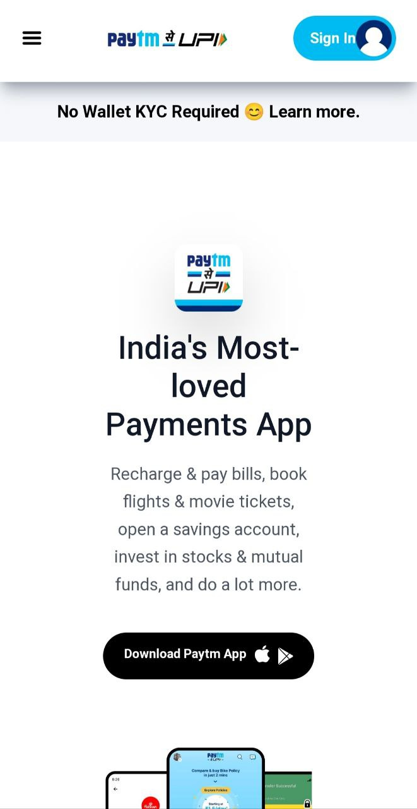

# Paytm | Paytm-Clone 
  

# Hi Everyone!!👋

## Project Name: Paytm Clone by Tailwind CSS

---

### Project Descripttion

> **This is a large project where I have made paytm clone by using Tailwind CSS and this project is mobile responsive also, Hope you like my project**

---

## 🛠 Technologies used

> HTML

> Tailwind CSS

---

## What I have learnt in this project

> As this is my first project on Tailwind CSS, I learned how to use the classes

> Learned about the responsiveness

> Got good understanding on responsiveness, breakpoints and many other classes

---

## Time taken to Finish this project

> I have taken 3 full day to understand and complete this project,because this was my first project on Tailwind.

## Project Screenshot

> .png)

